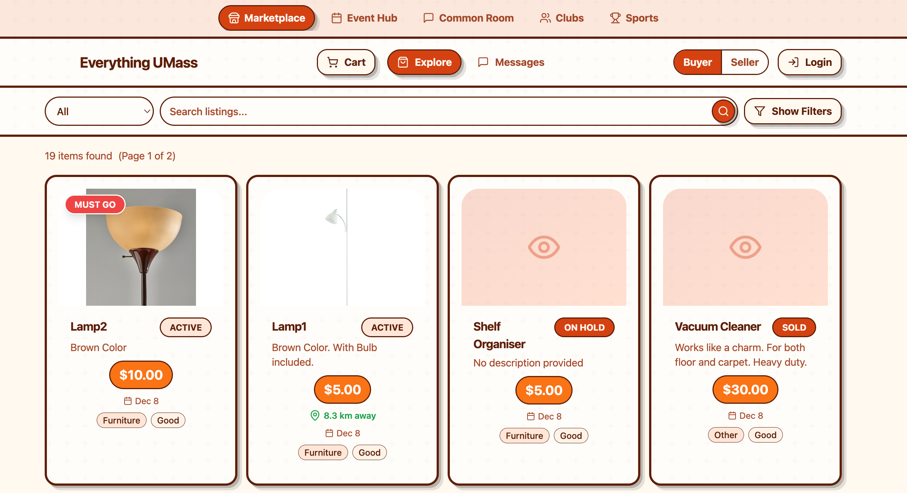
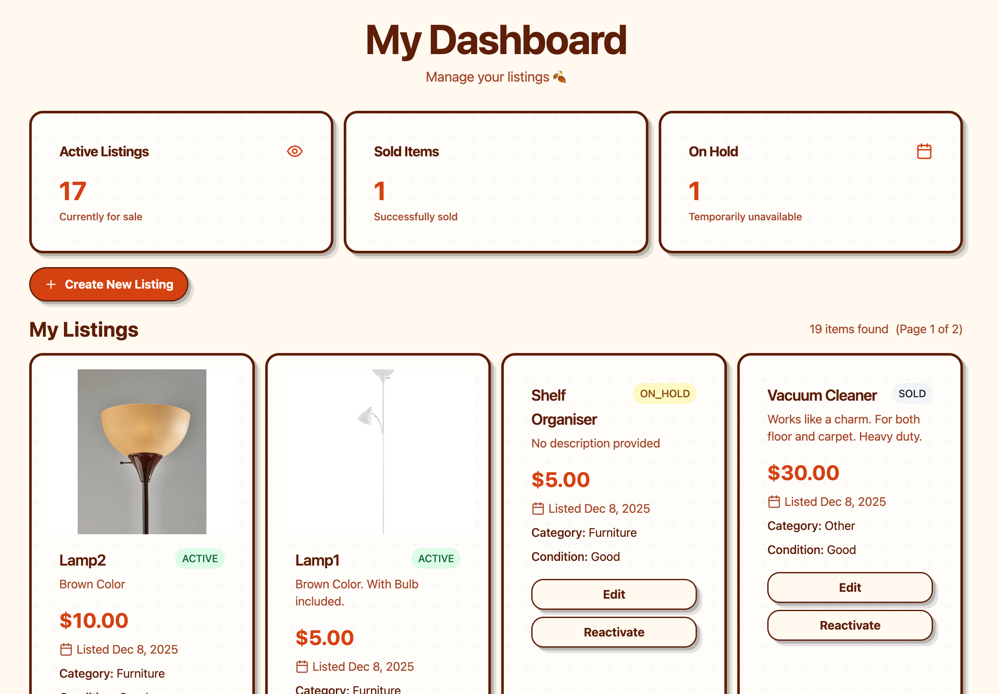
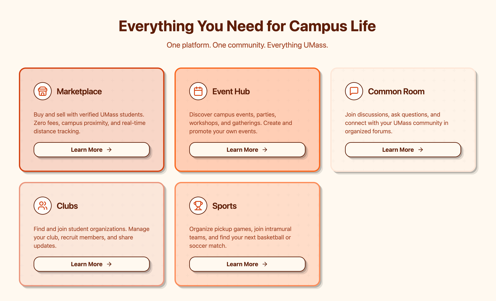
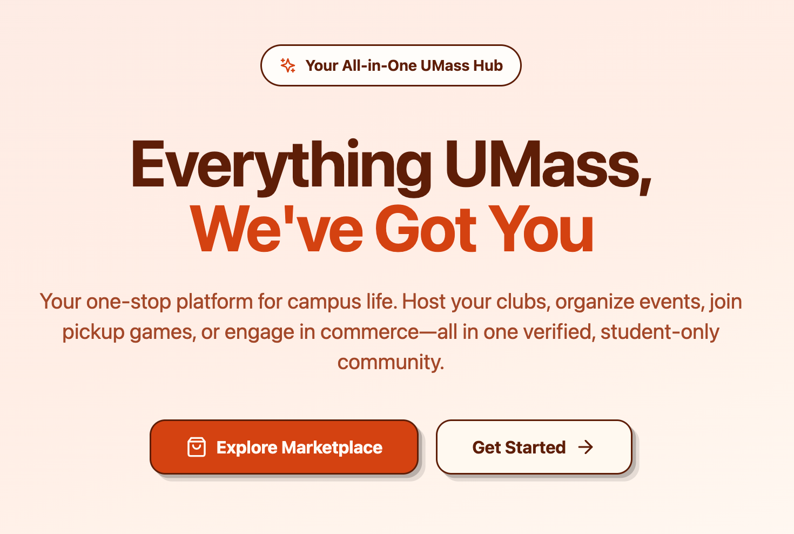

# Everything UMass

**Your All-in-One Campus Platform - Launching Next Semester**

Everything UMass is a student-only platform designed to transform how UMass students connect, buy, sell, and engage with campus life. Built specifically for the UMass community, we're creating a safer, more organized alternative to scattered Facebook groups, chaotic WhatsApp chats, and impersonal marketplaces.

## Elevator Pitch

**Everything UMass: We've Got You**

Starting next semester, UMass students will have access to a unified platform that brings together marketplace commerce, event organization, club management, sports coordination, and community forums—all in one verified, student-only space.

Unlike eBay, we charge zero transaction fees. Unlike Facebook Marketplace, every user is verified as a UMass student. Unlike WhatsApp groups, everything is searchable and organized. Unlike Craigslist, you see real-time distance to items on campus.

This is more than a marketplace—it's your complete campus hub. Host your clubs, organize events, join pickup games, or engage in commerce. Everything UMass, all in one place.

## Platform Overview

### Marketplace

Buy and sell with verified UMass students. Zero fees, campus proximity tracking, and real-time distance calculations make transactions convenient and safe.



### Seller Dashboard

Manage your listings, track sales, and monitor your marketplace activity from a centralized dashboard designed for student sellers.



### Future Vision

The platform is architected to expand beyond marketplace functionality, with planned features for events, clubs, sports, and community forums.



### Landing Experience

A welcoming entry point that showcases all platform capabilities and guides students to the features they need.



## Application Architecture

Everything UMass follows a modern three-tier architecture designed for scalability and maintainability:

```
┌─────────────────────────────────────────────────────────────┐
│                      Client Layer                            │
│                   (Web/Mobile Browser)                      │
└───────────────────────────┬─────────────────────────────────┘
                            │
                            │ HTTP/HTTPS
                            │
┌───────────────────────────▼─────────────────────────────────┐
│                  Frontend Application                       │
│  ┌──────────────┐         ┌──────────────┐                │
│  │ React 18 SPA │ ◄─────► │ Vite Builder │                │
│  │ TypeScript   │         │ Dev Server   │                │
│  └──────────────┘         └──────────────┘                │
│                                                             │
│  Tech Stack:                                                │
│  - React 18 + TypeScript                                    │
│  - Tailwind CSS + shadcn/ui                                 │
│  - React Query (API state)                                  │
│  - React Router (navigation)                                │
└───────────────────────────┬─────────────────────────────────┘
                            │
                            │ REST API
                            │
┌───────────────────────────▼─────────────────────────────────┐
│                    REST API Layer                           │
│  ┌──────────────────────────────────────────────┐          │
│  │         Spring Boot 3 Application            │          │
│  │  - REST Controllers                          │          │
│  │  - Service Layer                             │          │
│  │  - Repository Layer (JPA/Hibernate)         │          │
│  │  - Security (OAuth2 + JWT)                  │          │
│  └──────────────────────────────────────────────┘          │
│                                                             │
│  Tech Stack:                                                │
│  - Spring Boot 3.5.6                                        │
│  - Java 21                                                  │
│  - OpenAPI/Swagger Documentation                           │
└───────────────────────────┬─────────────────────────────────┘
                            │
                            │ JDBC
                            │
┌───────────────────────────▼─────────────────────────────────┐
│                    Database Layer                           │
│  ┌──────────────────────────────────────────────┐          │
│  │            PostgreSQL 16                     │          │
│  │  - User Management                           │          │
│  │  - Listing Storage                           │          │
│  │  - Chat Messages                             │          │
│  │  - Reviews & Ratings                         │          │
│  └──────────────────────────────────────────────┘          │
│                                                             │
│  Features:                                                  │
│  - Flyway Database Migrations                              │
│  - JPA/Hibernate ORM                                       │
│  - ACID Transactions                                       │
└─────────────────────────────────────────────────────────────┘
```

### Key Architectural Decisions

**Monorepo Structure**: All code lives in a single repository, enabling shared types, consistent tooling, and simplified deployment.

**API-First Design**: RESTful API with OpenAPI documentation ensures clear contracts between frontend and backend.

**Containerized Deployment**: Docker Compose setup allows consistent development and production environments.

**Type Safety**: TypeScript on the frontend and strong typing in Java ensure fewer runtime errors.

**Modern React Patterns**: React Query for server state, React Router for navigation, and component-based architecture.

## Core Features

### Verified Student Community

All users must authenticate with a @umass.edu email address, ensuring a closed, trusted community of verified students.

### Zero-Fee Marketplace

Unlike eBay or Facebook Marketplace, we charge no transaction fees. Students keep 100% of their sale price.

### Campus Proximity

Real-time distance calculations show exactly how far items are from your location, making meetups convenient and safe.

### Organized Listings

Searchable, filterable marketplace with categories, conditions, and price ranges. No more scrolling through endless chat messages.

### Seller Dashboard

Comprehensive dashboard for managing listings, tracking sales, and monitoring marketplace activity.

### Future Expansion

The platform architecture supports expansion into:
- Event Hub: Campus event discovery and organization
- Common Room: Community forums and discussions
- Clubs: Student organization management
- Sports: Pickup game coordination and team finding

## Technical Stack

### Frontend
- React 18 with TypeScript
- Vite for build tooling and dev server
- Tailwind CSS for styling
- shadcn/ui component library
- React Query for API state management
- React Router for navigation

### Backend
- Spring Boot 3.5.6
- Java 21
- PostgreSQL 16
- JPA/Hibernate ORM
- Flyway for database migrations
- OAuth2 + JWT authentication
- OpenAPI/Swagger documentation

### Infrastructure
- Docker and Docker Compose
- GitHub Actions for CI/CD
- PostgreSQL for data persistence

## Getting Started

### Prerequisites

- Docker and Docker Compose
- Node.js 18+ (for local development)
- Java 21+ (for local development)
- Maven 3.8+ (for local development)

### Quick Start

```bash
# Clone the repository
git clone https://github.com/shivraj-S-bhatti/umass-marketplace.git
cd umass-marketplace

# Copy environment variables
cp deploy/env.example deploy/.env

# Start all services
docker compose -f deploy/docker-compose.yml up -d

# Install frontend dependencies
npm install -C web

# Start frontend development server
npm run dev -C web

# Start API (in another terminal)
mvn spring-boot:run -f api
```

### Access Points

- Frontend: http://localhost:5173
- API: http://localhost:8080
- Swagger UI: http://localhost:8080/swagger-ui
- Database: localhost:5432 (umarket/umarket/umarket)

## Launch Timeline

**Current Status**: MVP Complete

The marketplace core functionality is complete and tested. We're preparing for a full launch next semester with:

- Complete OAuth2 authentication flow
- Enhanced search and filtering
- Image upload capabilities
- Real-time messaging between buyers and sellers
- Mobile-responsive optimizations

**Next Semester Goals**:
- Public beta launch for UMass students
- Expansion to Event Hub and Common Room features
- Club and Sports module development
- Mobile app development (React Native)

## Development

See [CONTRIBUTING.md](CONTRIBUTING.md) for development guidelines, code standards, and contribution instructions.

## Support

- Issues: [GitHub Issues](https://github.com/shivraj-S-bhatti/umass-marketplace/issues)
- Discussions: [GitHub Discussions](https://github.com/shivraj-S-bhatti/umass-marketplace/discussions)

## License

This project is licensed under the MIT License.

---

Built for UMass students, by UMass students.
